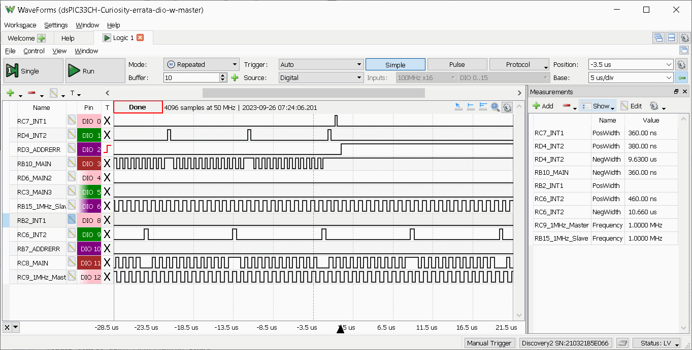

# dsPIC33CH ISR/REPEAT errata

Attempt to reproduce dsPIC33CH Slave core Errata, where
it may corrupt stack (by repeating entry instructions like - PUSH) or 
abort early REPEAT instruction leading to unexpected results.

Errata is available in this document:
- https://ww1.microchip.com/downloads/en/DeviceDoc/dsPIC33CH512MP508-Family-Silicon-Errata-and-Data-Sheet-Clarification-DS80000805K.pdf

Status:
- it successfully triggers AddressError TRAP in few seconds.

> WARNING!
>
> I think that this AddressError trap is because of Hardware error described in errata.
> However that it is still chance that it is not the case and that it is caused by some bug in my program(!).
>
> Please consider all content here WITHOUT ANY WARRANTY!

# Required Hardware

- [dsPIC33CH Curiosity Development Board DM330028-2](https://www.microchip.com/en-us/development-tool/DM330028-2)
- two Micro-B USB cables
  - one for programming debugging
  - 2nd for UART connection where are printed debugging instructions

# Required Software

- MPLAB X IDE v6.15
- XC16 v2.10
- DFP 1.14.357

# How to reproduce TRAP

Current code will lead to AddressError trap in few seconds.

What it does:
- Master Core
  - 8 Mhz external Clock, 180 MHz (90 MIPS) Core clock
  - toggles `RE0_LED1` every 50ms using Delay
  - toggles `RB2` on every CCP1 interrupt (~ 10 kHz)
  - toggles `RC6` on every CCP2 interrupt (~ 100 kHz)
  - rises `RB7` on Address Error trap
  - toggles `RC8` on every HW division 
  - toggles `RC9` at 1 Mhz rate using SCCP3/PWM in toggle mode.
    NOTE: Digilent Logic Base must be 1us/div or shorter to measure this frequency with enough precision.
- Slave Core
  - 8 Mhz external Clock, 200 MHz (100 MIPS) Core clock
  - debug messages on UART (`RC10_RXB` PIC Input, `RC11_TXB` PIC Output)
    - please use these `COMx` port settings on your PC: Speed 115200 Baud, 8-bit data, 1 stop bit,
      no parity, no flow control
  - toggles LED2 around every 1s using main loop Delay
  - rotating RGB LED around every second
  - toggle `RC7_ANA` on every CCP1 interrupt (~ 10 kHz)
  - toggle `RD4_RSTA` on every CCP2 interrupt (~ 100 kHz)
  - rise `RD3` on Address Error trap
  - toggles `RB10` on every HW division
  - toggles `RD6` main on entering outer `while(1){ ... }` loop
  - toggles `RC3` after Rotate RGB LEDs
  - toggles `RB15` at 1 Mhz rate using SCCP3/PWM in toggle mode.
    NOTE: Digilent Logic Base must be 1us/div or shorter to measure this frequency with enough precision.

Both cores:
- permanently lit LED1 (for Master) or LED2 (for Slave) in case of TRAP.

When:
- CCP1 interrupt frequency is around 10 kHz
- CCP2 interrupt frequency is around 100 kHz

I get trap
```
TRAPS_ADDRESS_ERR = 2, /** Address error Trap vector */
```

This is modified version where trap occurs significantly faster:
```
SLAVE main:189 starting v1.01
SPLIM=20464 (0x4ff0)
!2
```
Before Main loop debug messages get chance...

The `!2` is trap message from customized `ErrataSlave.X/mcc_generated_files/traps.c`,
where `!` means Trap occurred and `2` is Error code - in this case `AddressError`.
Also red LED2 should stop blinking and RGB LED should stop rotating (currently accidentally on Green, but
it is just coincidence).

And here is Analyzer output:



And `Digilent Analog Discovery 2` analyzer Workspace file:

- [assets/dsPIC33CH-Curiosity-errata-dio.dwf3work](assets/dsPIC33CH-Curiosity-errata-dio.dwf3work)


# Resources

* Official Curiosity Board page:
  - https://www.microchip.com/en-us/development-tool/DM330028-2
* Errata for dsPIC33CH512 used on Curiosity board
  - https://ww1.microchip.com/downloads/en/DeviceDoc/dsPIC33CH512MP508-Family-Silicon-Errata-and-Data-Sheet-Clarification-DS80000805K.pdf


